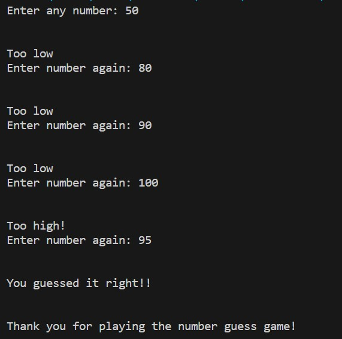

# numberGuess
Welcome to the Number Guessing Game! This Python program is an exciting game where you try to guess a randomly generated number within a specified range. Test your guessing skills and see if you can hit the jackpot!

# How to Play
    The program will randomly select a number between a predefined range (e.g., 1 and 100).

    Your task is to guess the correct number within that range.

    Enter your guess when prompted by the program.

    The program will provide you with feedback on your guess:
    1. If your guess is correct, you win!
    2. If your guess is incorrect, the program will tell you whether your guess is too high or too low.
    3. Keep guessing until you correctly guess the number or decide to quit the game.

# Getting Started
    Follow these steps to get started with the Number Guessing Game:

    1. Clone the Repository: Clone this repository to your local machine using your preferred method.

    2. Run the Game: Open a terminal or command prompt and navigate to the project directory. Run the game.
    3. Play the Game: Follow the on-screen instructions to play the Number Guessing Game.

# Example
    

# Customization
You can customize the range of numbers for the game by modifying the minimum number and maximum number range (line 3) in the source_code.py file. Feel free to adjust these values to change the difficulty of the game.

# Contributions and Feedback
This project was created as a fun and interactive Python exercise. If you have any suggestions for improvements or new features, feel free to fork this repository, make changes, and submit a pull request. If you encounter any issues or have feedback, please open an issue in the repository.

Happy guessing!
